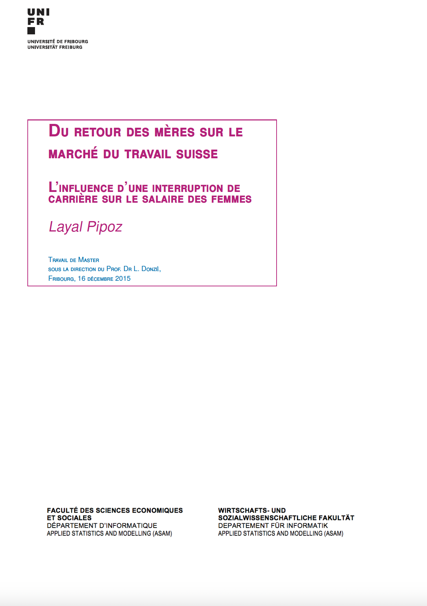

# Du retour des mères sur le marché du travail suisse. L'influence d'une interruption de carrière sur le salaire des femmes
---

## Summary
In our work, based mainly on the study by [Hotchkiss and Pitts (2005)](https://www.tandfonline.com/doi/abs/10.1080/0003684042000307003), we are interested in the wage income of women who experience a professional career interrupted by one or more absences of more than one year due to maternity. 

This type of career path is termed intermittent and illustrates a three-phase model, consisting of a period of interruption between two active periods in the labour market. We are therefore led to divide the female population into two sectors, i.e. the continuous and intermittent sectors.

We learn from [Hotchkiss and Pitts (2005)](https://www.tandfonline.com/doi/abs/10.1080/0003684042000307003) that a wage penalty for women in the intermittent sector, compared to those in the continuous sector, is widely accepted within the research community. However, its magnitude is still controversial and needs to be determined. 

Moreover, this wage differential is likely to exert influences on the choice of career type as well as on the choice of participating or not in the labour force. This influence may differ according to the socio-cultural characteristics of each individual. We will therefore attempt to answer these questions for Swiss women, unlike [Hotchkiss and Pitts (2005)](https://www.tandfonline.com/doi/abs/10.1080/0003684042000307003) who test these hypotheses for American women.

Please consult the [master thesis](https://www.academia.edu/97959159/Du_retour_des_mères_sur_le_marché_du_travail_suisse_Linfluence_dune_interruption_de_carrière_sur_le_salaire_des_femmes) (French version but also available in English thanks to the Acadmia translator) for more information. 