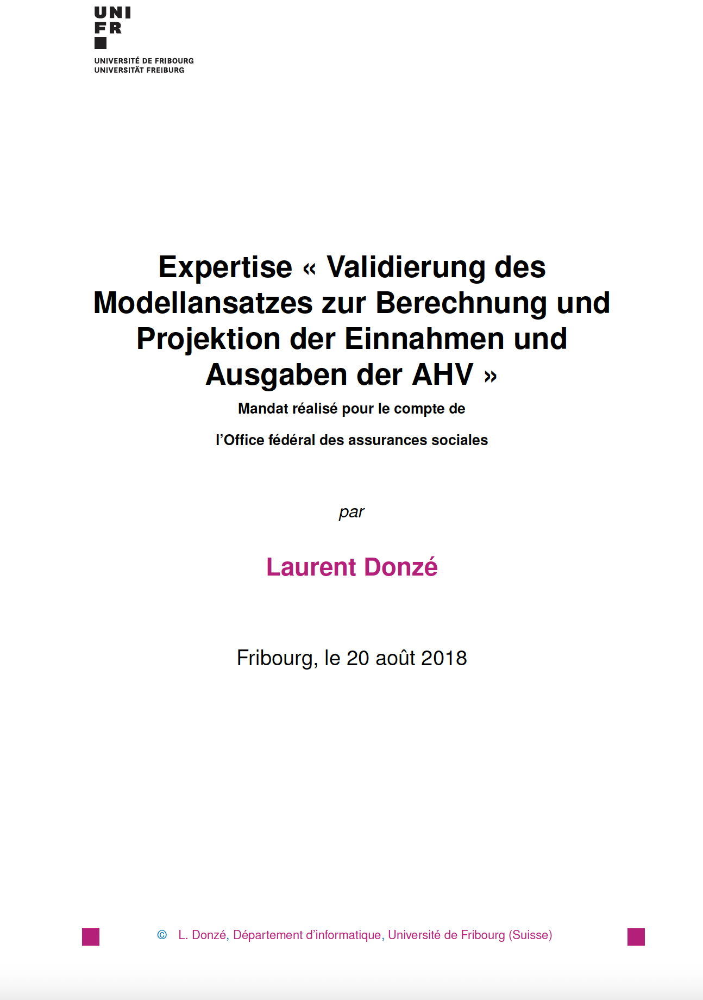

# Validation of the model approach for calculating and projecting OASI income and expenditure
---

## Summary
As part of its "Phoenix" project, the Mathematics Section of the [FSIO](https://www.bsv.admin.ch/bsv/en/home.html) is responsible, among other things, for the development and re-implementation of the calculation of the OASI budget in the short and long term. This has recently been implemented with the R software. This new tool allows for the flexible projection of long-term pension amounts. With a view to a new reform of the OASI financing system, it is therefore essential to have reliable estimates of the OASI budget. 

With this in mind, the [FSIO](https://www.bsv.admin.ch/bsv/en/home.html) decided to have its pension modelling validated by external experts. We have been commissioned to do this. In particular, the model for the long-term calculation of expenditures and revenues must be validated according to

1. the completeness of the model;

2. the parametrisation and plausibility of the model's assumptions

3. the implementation in computer code, in particular from the point of view of the consistency
between the documentation and the code.

To answer our mandate, we first detail the adopted modelling to better understand it. We then describe the implementation that was made in computer code. Finally, we give an overall assessment.

Please consult the [article](https://www.bsv.admin.ch/dam/bsv/de/dokumente/ahv/finanzperspektiven/validierung-modellansatz-ahv.pdf.download.pdf/2018_07_09_definitif_ld_rapport_ofas.pdf) for more information.