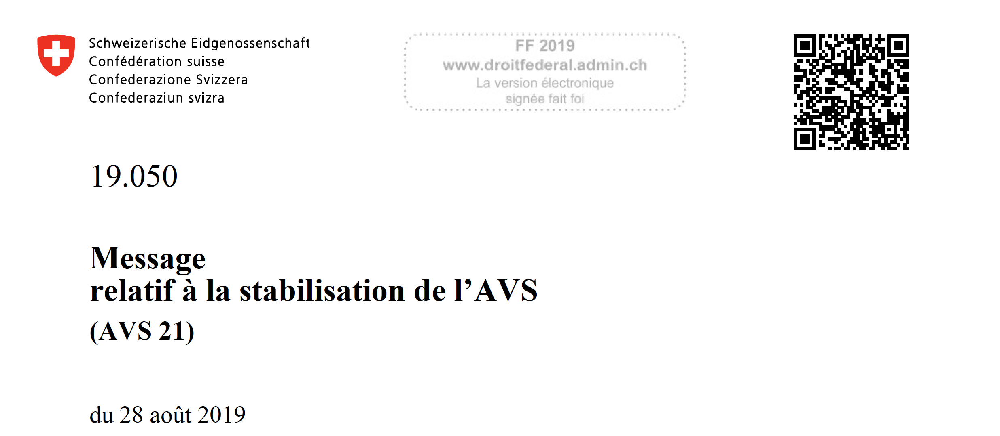

# Botschaft zur Stabilisierung der AHV (AHV 21) / Message relatif à la stabilisation de l'AVS (AVS 21)
---

## Summary
This message was adopted by the Swiss Federal Council on August 28, 2019. My contribution (together with the team of mathematicians of the [FSIO](https://www.bsv.admin.ch/bsv/en/home.html)) to this message was mainly the modelling and the production of the several variants of the Old-Age and Survivors' Insurance (OASI) financial budget featured on the last pages of the document.
