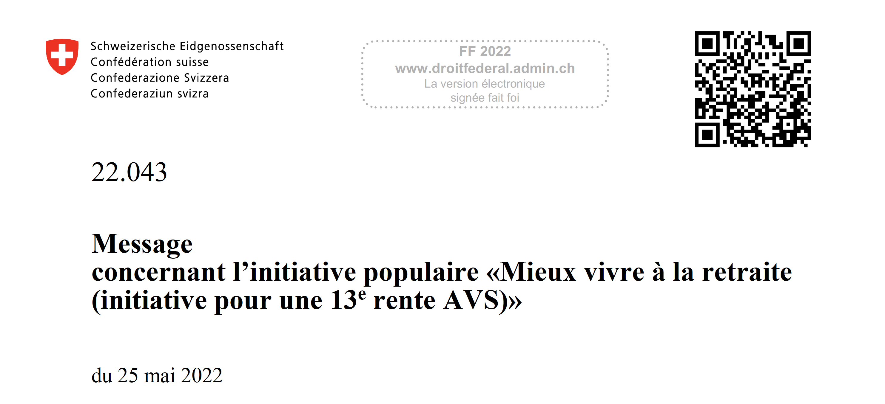

# Botschaft zur Volksinitiative "Für ein besseres Leben im Alter (Initiative für eine 13. AHV-Rente)" / Message concernant l’initiative populaire "Mieux vivre à la retraite (initiative pour une 13e rente AVS)"
---

## Summary
This message was adopted by the Swiss Federal Council on May 25, 2022. My contribution (together with the team of mathematicians of the [FSIO](https://www.bsv.admin.ch/bsv/en/home.html)) to this message is mainly the modelling and the production of the several variants of the Old-Age and Survivors' Insurance (OASI) financial budget featured on the last pages of the document.
