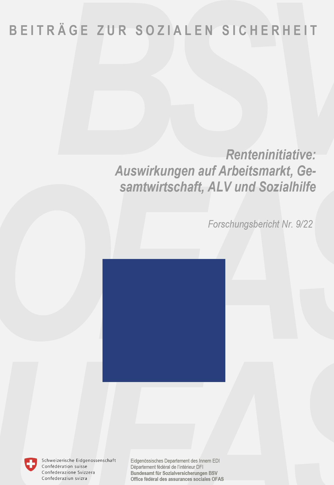

# Renteninitiative: Auswirkungen auf Arbeitsmarkt, Gesamtwirtschaft, ALV und Sozialhilfe 
## Forschungsbericht Nr. 9/22
---

## Summary
This research project is about the effects of the Popular Initiative about the OASI Pensions on the labor market, the economy, the unemployment insurance and the social benefits.

My contribution to this research report was the model calculation, the revision and the discussion with the entity commissioned to draft this report about the model provided by the text of the initiative. I belonged to the support group constituted by legal experts, economists and political scientists (among others) working at the [FSIO](https://www.bsv.admin.ch/bsv/en/home.html).

Please consult the [research report](https://www.bsv.admin.ch/bsv/de/home/publikationen-und-service/forschung/forschungspublikationen/_jcr_content/par/externalcontent_130482312.bitexternalcontent.exturl.pdf/aHR0cHM6Ly9mb3JzY2h1bmcuc296aWFsZS1zaWNoZXJoZWl0LW/Noc3MuY2gvd3AtY29udGVudC91cGxvYWRzLzIwMjIvMDYvOV8y/MkRfZUJlcmljaHQucGRm.pdf) for more information.

