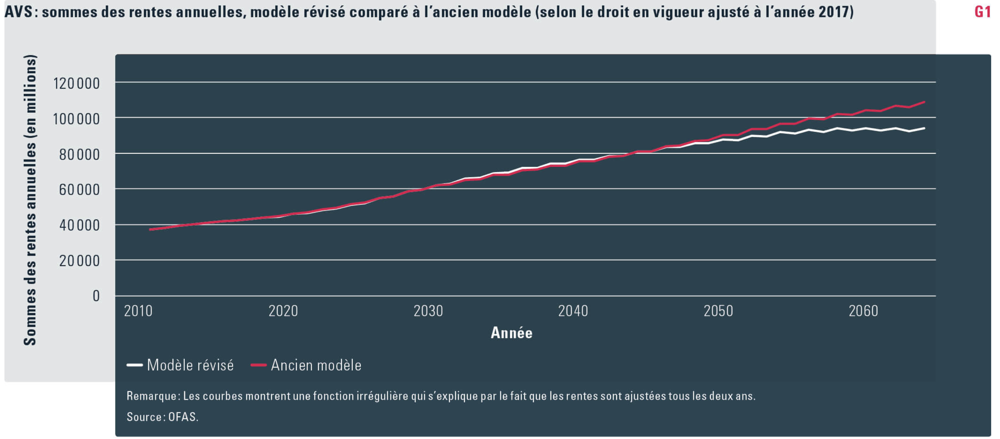

# Projection model of the Old-age and survivor's insurance (OASI) expenses
---

## Summary
This article documents the reasons why the OASI's expenses model has been adapted
in the spring 2018. On one hand, more transparency and rapidity in the computation
were necessary. R was the chosen solution to reach these objectives. On the 
other hand, the computation method was different for the Swiss and the foreign
population. The R programming language allowed to standardize the model more 
efficiently.
