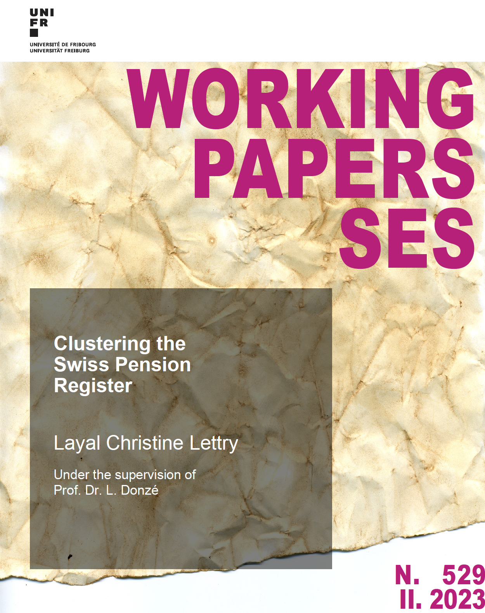

# Clustering the Swiss Pension Register
---

## Summary
The anonymous data of the Swiss Pension Register (CCO/FSIO) (PR) are typically used to estimate (in the short, middle and long term) the future revenues and expenditures of the Old-Age and Survivors’ Insurance (OASI). In this perspective, it is essential to have a clear look at the register’s main statistical features. To better understand it and benefit more from its richness, we propose analysing the raw data by an appropriate clustering method.

Please consult the [working paper](https://folia.unifr.ch/unifr/documents/324081) for more information.